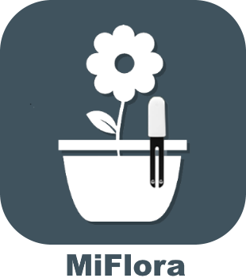

    

### Master:   

### Develop:   

# Présentation:

Plugin permettant de récupérer les informations des Parrot flower power, Parrot plants, Xiaomi Plants ou MiFlora.

Les Xiaomi Plants sont des sticks Bluetooth de la marque Xiaomi permettant de mesurer l’hygrométrie, la température, la lumière, l’engrais d’une plante. Nul besoin d’autre chose qu’une connexion Bluetooth, y compris via des antennes déportées.

Le Parrots flower est la version originale de Parrot du stick MiFlora, le Parrot Pot est un pot de fleurs avec les fonctionalités du Parrot flower.

# Documentation du plugin:
 
[présentation](docs/fr_FR/presentation.md) [configuration](docs/fr_FR/configuration.md) [faq](docs/fr_FR/faq.md) [changelog](docs/fr_FR/changelog2.md)

# Documentation complète:

